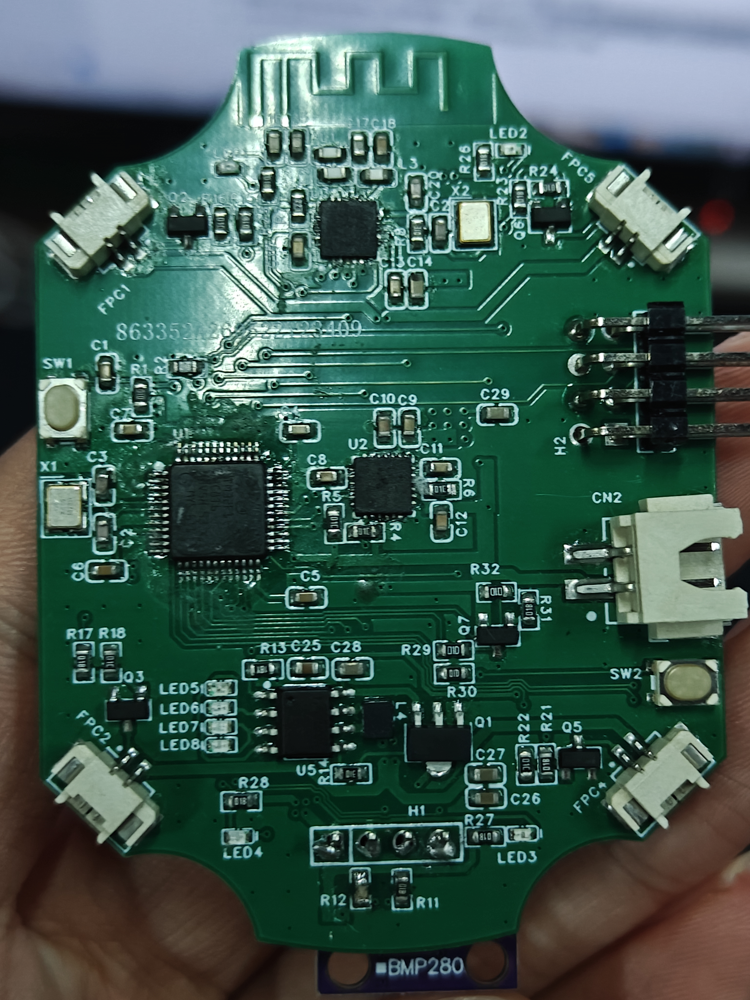
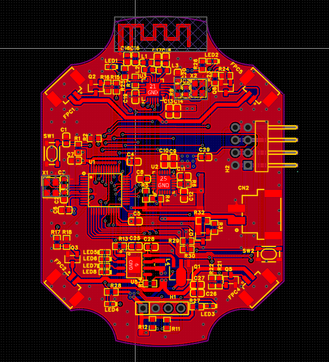

# STM32 FreeRTOS 四旋翼无人机

基于 STM32F103C8T6 和 FreeRTOS 的四旋翼飞控二次开发项目，仓库同时包含飞控端与遥控器端代码。

本项目重点不是简单移植例程，而是在已有课程工程基础上完成 BMP280 气压计接入、定高控制、双向遥测和通信安全逻辑改进。

## 实物与 PCB

| 飞控板实物（含 BMP280） | 飞控板 PCB 版图 |
| --- | --- |
|  |  |

立创 EDA 专业版工程：

- `hardware/flight-controller/stm32_quadcopter.eprj2`：飞控板工程
- `hardware/remote-controller/quadcopter_remote.epro2`：无人机手柄遥控器工程

## 主要功能

- FreeRTOS 多任务调度：飞行控制、无线通信、状态指示和电源管理
- MPU6050 姿态采集、姿态解算和串级 PID 控制
- 四电机 PWM 混控、输出限幅和低油门保护
- BMP280 软件 I2C 驱动、总线恢复、温度/气压补偿与高度计算
- 定高状态切换及高度闭环控制
- 遥控数据帧校验、解锁状态机和 200 ms 断联保护
- 飞行高度等状态数据回传与遥控器端显示

## 仓库结构

```text
.
├── P01_flight_hal/       # 飞控端：传感器、姿态/PID、电机与无线通信
├── P02_remote_hal/       # 遥控器端：摇杆、按键、显示与双向通信
├── docs/images/          # 实物照片与 PCB 版图
└── hardware/             # 飞控板与遥控器的立创 EDA 工程
```

关键代码：

- `P01_flight_hal/MDK-ARM/Application/`：飞控任务、状态机和控制逻辑
- `P01_flight_hal/MDK-ARM/interface/int_bmp280.c`：BMP280 驱动与高度计算
- `P01_flight_hal/MDK-ARM/interface/int_mpu6050.c`：MPU6050 接口
- `P02_remote_hal/MDK-ARM/Application/`：遥控指令发送、遥测接收与显示

## 控制与通信流程

```text
遥控器摇杆/按键
      ↓
无线数据帧 + 校验
      ↓
飞行状态机与断联保护
      ↓
MPU6050/BMP280 → 姿态与高度控制 → 电机 PWM
      ↓
高度等遥测数据回传至遥控器
```

## 构建

环境：Keil MDK-ARM、STM32CubeMX，目标芯片为 STM32F103C8T6。

1. 飞控端打开 `P01_flight_hal/MDK-ARM/P01_flight_hal.uvprojx`。
2. 遥控器端打开 `P02_remote_hal/MDK-ARM/P02_remote_hal.uvprojx`。
3. 分别编译并下载到对应控制板。

仓库保留了 `.ioc` 文件，可用于查看外设和引脚配置。整理前的两个目标均有 `0 Error(s), 0 Warning(s)` 的构建记录；构建产物和本机日志未提交。

## 项目边界

- 这是课程/参考工程基础上的二次开发，不将底层模板和第三方组件声明为个人原创。
- 个人工作重点为 BMP280 驱动、定高控制、遥测回传、通信超时保护和任务逻辑调整。
- PCB 文件来自课程/复刻与已验证参考资料，用于说明硬件实现，不声明整套硬件完全原创。
- 资料中存在多个硬件和固件版本，接线或打板前应以实际烧录固件为准，重新核对引脚与原理图。
- 飞行器参数与机架、电机、桨叶和传感器安装有关，实际使用前必须拆桨调试并重新校准。
- 源文件包含 GBK 与 UTF-8 两种历史编码，仓库保持原始编码以兼容现有 Keil 工程。

第三方组件及版权说明见 [THIRD_PARTY_NOTICES.md](THIRD_PARTY_NOTICES.md)。
